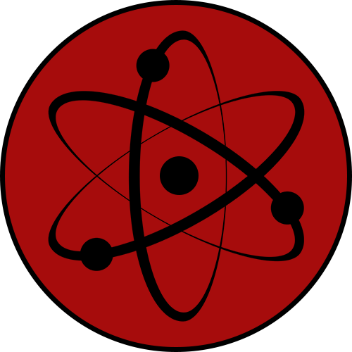

# Техническое задание для Favoras

## github.com/atom-tm/atom-tm.github.io

Write-доступ к репозиторию предоставлен.

Основной сайт команды, доступен по адресу https://atom-tm.github.io

- __Должен__ содержать описание команды, ее работ, ссылки на соц. сети;
- Сайт __должен__ быть одностраничником (в идеале SPA), хостится через GitHub Pages;
- В силу специфики GitHub Pages, веб-сайт не должен иметь обязательной серверной части;
- Для создания SPA __можно__ воспользоваться фреймворками VueJS или ReactJS;
- Для описания таблиц стилей __желательно__ воспользоваться SASS вместо обычного CSS;
- Для CSS __можно__ пользоваться __любыми__ фреймворками (Bootstrap, Foundation и т.д.). 
Мы __рекомендуем__ [Fomantic-UI](https://fomantic-ui.com/);
- Вся информация __должна__ быть легко доступна на единственной странице, часть информации __можно__ прятать за спойлеры / навбары / программную навигацию (динамический роутинг);
- Мы __не приветствуем__ использование jQuery.

#### Требования к дизайну и верстке

- минималистичный, строгий;
- минимум скруглений элементов;
- используемые цвета не должны конфликтовать с красным логотипом команды;
- рекомендуемые оттенки: белый, оттенки серого, черный;
- плавность анимаций и взаимодействий (например, плавная смена цвета ссылки);
- ссылки на соц. сети желательно оформить в виде логотипов соц. сетей.

Любые дополнительные эффекты (выпадающие списки, параллакс, плавный скроллинг, псевдо-объемность и т.п.) имеют место быть и зависят только от фантазии / возможностей исполнителя и обоснованности этих эффектов дизайном.

#### Разделы

- Описание команды | О нас
- Проекты | Наши работы
- Наша команда | Действующие и бывшие участники
- Ссылки на соц. сети | Мы в соцсетях

#### Доступные ресурсы и фирменный стиль

В архиве с заданием в приложении можно найти описания, логотипы и прочее.

Описание команды доступно в [description.txt](description.txt).  
Список проектов команды доступен в [projects.txt](projects.txt).  
Палитру цветов __можно__ подсмотреть в [аватарке группы вк](lgroup.jpg).  
На сайте __должен__ присутствовать [логотип команды](logo.png)  

#### Ссылки

Логотипы доступны в [social/](social/)

* https://youtube.com/KDFeniks - YouTube канал Касая
* https://vk.com/atom_tm - группа команды в ВК
* https://github.com/atom-tm - GitHub команды
* https://discordapp.com/invite/s6vBRE4 - сервер в Discord
* http://lfforever.ru - русскоязычное сообщество игроков в LF2

P.S> Картинки `1-4.png` я добавил для рофла, если ты сможешь придумать с ними какой-нибудь мем :)

## github.com/atom-tm/love2d_fighting

Read-only доступ.

Основной репозиторий движка L2DF команды.

Для данного проекта необходимо документация, текущая ее версия доступна по ссылке: 
https://atom-tm.github.io/love2d_fighting/DOCUMENTATION.RU

В будущем документация будет доступна по ссылке: 
https://atom-tm.github.io/l2df

Новая версия документации автоматически генерируется через LDoc: [ldoc.zip](ldoc.zip)  
Пример сгенерированной документации: [docs/](docs/index.html)  
Старая документация: [docs/ru/](docs/ru/index.html)  

При генерации LDoc использует шаблоны:

- html, [ldoc.ltp](docs/ldoc.ltp)
- css, [ldoc.css](docs/ldoc.css)

Данные шаблоны можно модифицировать, подключать к ним JS и т.д.

#### Задачи:

1. Перед началом основных работ необходимо сверстать базовую страницу документации и согласовать дизайн;
2. Создать три основных экрана документации:
	* базовая страница (индекс);
	* страница с описанием класса / модуля;
	* страница со смешанным контентом, содержащая markdown-документ.
3. Созданный дизайн необходимо перенести на шаблоны: `ldoc.ltp` и `ldoc.css`;
4. Для написания CSS стилей рекомендуется использовать SASS, который будет создавать конечный `ldoc.css`;
5. JS фреймворки приветствуются;
6. CSS фреймворки допускаются.
